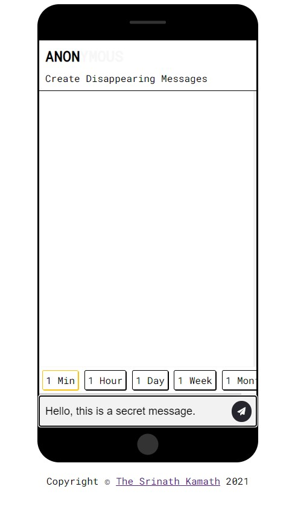
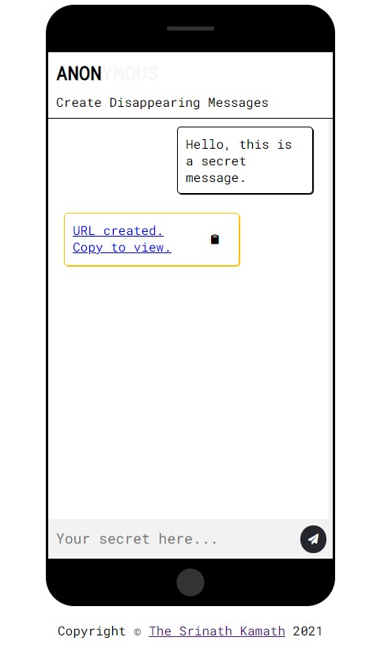
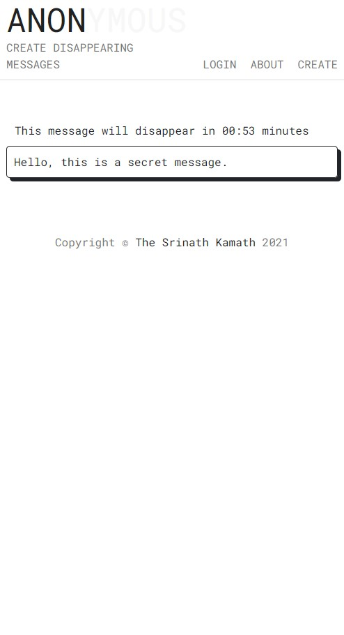

# surveySparrowTest
This is an Angular application for Survey Sparrow Machine test

## Anonymous URL - Create disappearing messages

### Project description
This is a NodeJS application to create disappearing messages. App allows the user to generate temporary URLs to share self-desctructing messages after a given time interval.

### Project Demo

  
  

  
  

### Project setup
1) Clone the repository - `git clone https://github.com/TheSrinathKamath/surveySparrowTest.git`
2) Navigate to the source folder - `cd src`
3) Install dependencies - `npm i`
4) Add environment variables - `.env`
5) Import database from `src/database/anonymous.sql`
6) Run the app - `npm run start`
7) To Run app in development mode - `npm run dev`
8) Visit `localhost:2021` or `PORT` can be defined in the `.env` file.

### API end-points
1) `/` - loads the UI
2) `/create` - `post` request to generate an Anonymous URL for your message
4) `/view/:messageHash` - `get` request to access the disappearing message
